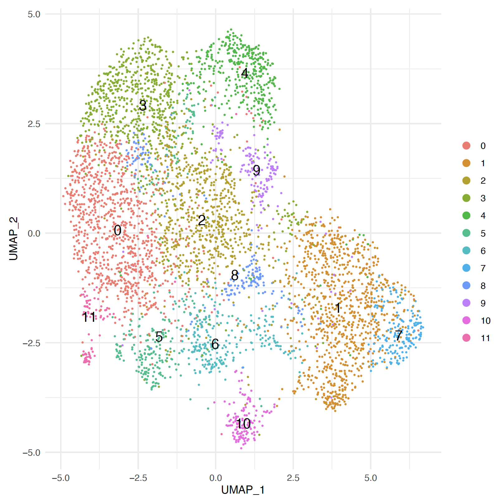
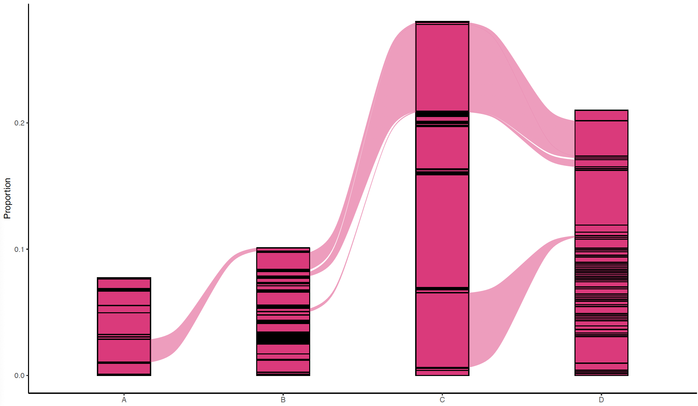

   
   
   

# *CROCKETA*: Pipeline for the multi-omic analysis of *scRNAseq + scTCR/BCRseq* data
###### Implemented by: 
***Gonzalo Soria-Alcaide***

*Marta Portasany-Rodríguez*

*Jorge García-Martínez*

###### Citation: [DOI 10.1101/2025.05.16.654451](https://doi.org/10.1101/2025.05.16.654451)
## Introduction

 

***CROCKETA*** (single-**C**ell **R**epertoire **O**rganization & **C**ombined **K**inetics **E**xploration for **T**ranscriptomic **A**nalysis) is an automated and adaptable [*Snakemake*](https://snakemake.readthedocs.io/en/stable/) pipeline designed to perform fundamental initial stages of single-cell analysis for both transcriptomic and immune repertoire data,
with additional steps for detailed assay characterization. *CROCKETA* has the goal of integrating different types of sequencing data in a multi-omic approach while expanding the transcriptional analysis itself:
* Pipeline can be executed exclusively for *scRNAseq* data from multiple sequencing technologies.
* [scRepertoire R Package](https://github.com/BorchLab/scRepertoire) if enabled allows integration of *scTCR/BCRseq* data as an intermediate module of the workflow in order to integrate clonotype information in downstream transcriptional analysis -such as DEAs, GSEAs or trajectory inference analysis- while accounting for immune repertoire analysis.
* Integration with vdj data is currently limited to ***10x* sequencing technology**

This pipeline uses state-of-the-art single-cell RNA-seq tools like [Seurat](https://satijalab.org/seurat/), [STARsolo](https://github.com/alexdobin/STAR/blob/master/docs/STARsolo.md), [Vision](https://github.com/yoseflab/VISION), [Slingshot](https://github.com/kstreet13/slingshot), [Velocyto](http://velocyto.org/), [Azimuth](https://azimuth.hubmapconsortium.org/), [SingleR](https://github.com/dviraran/SingleR), [DoubletFinder](https://github.com/chris-mcginnis-ucsf/DoubletFinder), [scRepertoire](https://github.com/BorchLab/scRepertoire) and [Immunarch](https://github.com/immunomind/immunarch).

The use of Snakemake alongside [conda](https://docs.conda.io/en/latest/) package manager facilitates version control, software requirements, and reproducibility of the results which is the main purpose of this tool. Moreover, ***CROCKETA*** implements different ways to correct for batch effects, allowing an easy-to-follow pipeline for large-scale datasets.

***CROCKETA*** has undergone rigurous testing for both *human* and *mouse* datasets.

### Input Data to analyse

#### Expression data format for the analysis can be either:

* fastq.gz raw data files
* count data matrices:
    * **10x**-like input (matrix.mtx + genes.tsv + barcodes.tsv)
    * **standard** matrix (where rows are genes and columns are cells)

#### Repertoire contig annotation can be either:

* Extracted through the pipeline in the cellranger step **if FASTQ file format** provided.
* User-provided csv files if already available. All contig files must be stored in the same directory and named after: {sample}_filtered_contig_annotation.csv. Path to files will be specified in *config.yaml* file at the seurat_screpertoire section.

## Table of Contents

1. [Pipeline configuration](#1-Pipeline-configuration)
   - [1.A- Installation & setup](#1a--installation--setup)
   - [1.B- Analysis configuration](#1b--Analysis-configuration)
     	- [I. samples.tsv file](#i-samplestsv-file)
     	- [II. units.tsv file](#ii-unitstsv-file)
     	- [III. config.yaml file](#iii-configyaml-file)
2. [Get Ready to launch](#2-Get-Ready-to-launch)  
3. [ANALYSIS OUTPUTS](#3-ANALYSIS-OUTPUTS)
4. [Troubleshooting and benchmarking](#Troubleshooting-and-benchmarking)
5. [Resource optimization](#Resource-optimization)
6. [HTML Reports](#HTML-Reports)
7. [Scanpy interoperability](#Scanpy-interoperability)
8. [Known Issues](#Known-Issues)
9. [Implementation Details](#Implementation-Details)
10. [CITATION](#CITATION)

## 1. Pipeline configuration	
*CROCKETA* is based on the previously published [Bollito workflow](https://github.com/cnio-bu/bollito) and follows a similar tool configuration and structure.  

Three input files must be provided to describe data structure, defining desired parameters and path to input files among others:
* **config.yaml** contains all pipeline parameters.
* **samples.tsv** contains information on the samples to be analysed, including paths to TCR/BCR sequencing files and (optionally) sample metadata.
* **units.tsv**: contains information and paths regarding gene expression data files associated with each sample.

Description of these files is provided below at section 1.B.

### 1.A- Installation & setup

<i>CROCKETA installation...</i>

Workflow requires previous conda installation in order to handle package management for each of the analysis steps. Follow [bioconda installation instructions](https://conda.io/projects/conda/en/latest/user-guide/install/index.html#installing-conda). 
Conda installation can be avoided if singularity is already installed by providing --use-singularity option when running the pipeline.

If conda installed, It is highly advisable to create a specific environment to avoid conflicts (e.g. numpy, detailed below)

	conda create -n crocketa
 	conda activate crocketa

Afterwards, a local copy of this repository must be created from **Github**:

    git clone https://github.com/OncologyHNJ/crocketa.git

Then, ***CellRanger-7.2.0*** must be downloaded externally & unzipped in scripts/ folder from [***CellRanger previous releases***](https://www.10xgenomics.com/support/software/cell-ranger/downloads/previous-versions/):

	wget -O /path/to/crocketa/scripts/cellranger-7.2.0.tar.gz "link_to_v7.2.0_fromCellRanger.tar.gz"
	tar -xzvf /path/to/crocketa/scripts/cellranger-7.2.0.tar.gz --directory=/path/to/crocketa/scripts/

To run *GSEApreranked* analysis, an external [Java 11](https://www.oracle.com/es/java/technologies/javase/jdk11-archive-downloads.html) installation is required. Ubuntu user might run:

	sudo apt install openjdk-11-jre-headless

 To create reports propperly, Numpy installation v1.23.5 is required. Ubuntu user might run (specify ***your*** current python version):

	python3.10 -m pip install --user numpy==1.23.5

### 1.B- Analysis configuration

<i><b>samples.tsv</b>, <b>units.tsv</b> & <b>config.yaml</b> files...</i>

*samples.tsv*, *units.tsv* & *config.yaml* files must be configured before running the pipeline, in order to fit each experiment. 

#### I. samples.tsv file

This file will provide user-defined information regarding each of the samples to be analyzed. First 5 columns are mandatory and must follow order below:

| **Column** | **Field name** 	| **Description**  |
|------------	|------------------|----------------------------------	|
| Column *1* | **sample**     	| Defines the sample name for each sample. |
| Column *2* | **sample_TCR**    | Defines the sample name for TCR sample. NULL if not necessary.  |
| Column *3* | **sample_BCR**    | Defines the sample name for BCR sample. NULL if not necessary.  |
| Column *4* | **vdj_fqPATH_TCR** | Defines the path to each TCR sample. NULL if not necessary.   |
| Column *5* | **vdj_fqPATH_BCR** | Defines the path to each BCR sample. NULL if not necessary. |
| Additional columns | **metadata name** | Optional columns to provide metadata for each sample: condition, patient, tissue of origin, etc. |

Notice that you can perform the analysis exclusively for scRNA-seq data or combined with any other repertoire layer of information: scRNA-seq + scTCR-seq data, scRNA-seq + scBCR-seq data or all three -omics: scRNA-seq + scTCR-seq + scBCR-seq

The other columns are used to describe the samples. Each column from column 6 to last column will be stored as metadata in the Seurat object.Therefore, each column will be a metadata condition (header will correspond to condition name) and each single cell belonging to each single sample is labeled with the corresponding value defined by the user (e.g. tissue to define tissue of origin for each sample, disease condition, patient, etc).

A draft file is provided in the repository (*draft-samples_gex.tsv* or *draft-samples_gex_vdj.tsv* as TCR sequencing example).

Note that sample names for TCR/BCR data should match folder storing data and partial fastq names as given in *draft-samples_gex_vdj.tsv*. If TCR data is given by for example sample_1_TCR_S2_L001_R1_001.fastq.gz (+ all other fastq.gz files), then these files should be stored at /path/to/sample_1_TCR/ directory. Same for BCR data. This is the usual 10x sequencing storing format.

#### II. units.tsv file

This file will define path to gene expression data and some details regarding each sample. This will be the same for gene-expression exclusive or gene-expression + vdj sequencing analysis.

As expression data can be provided in different formats, there are different ways to configure this file:

* FastQ file format:

| **Column** | **Field name** 	| **Description**                                         	|
|------------|------------|-----------------------------------------------------	|
| Column *1* | **sample**     	| Sample name (must match the sample name specified in *samples.tsv*).         	|
| Column *2* | **unit**       	| A distinct name for each pair of files associated to the same sample (for example in the case of replicates).|
| Column *3* | **fq1**        	| FASTQ file for read 1, containing the Cell Barcode and UMI.  	|
| Column *4* | **fq2**        	| FASTQ file for read 2, containing the transcriptomic sequence.       	|

* Matrix file format (standard or 10x):

| **Column** | **Field name**            	| **Description**|
|--------------|-----------------------|-------------------------------------------------------------	|
| Column *1* | **sample**                	| Sample name (must match the sample name specified in *samples.tsv*).|
| Column *2* | **matrix**                	| Matrix file (.mtx for 10x or .tsv for standard) storing the counts.|
| Column *3* | **cell_names** (10x only) 	| tsv file containing one cell name per row.|
| Column *4* | **gene_names** (10x only) 	| tsv file containing one gene name per row.|
| Column *5* | **metadata** (optional) 	| tsv file with two or more columns. First column corresponds to each cell name specified in *cell_names.tsv* and the rest are metadata variables. First row indicates the metadata variable name.       |

A draft file is provided in the repository for all three formats (*draft-units_fastq.tsv* ; *draft-units_matrix.tsv*; *draft-units_matrix_10x.tsv*).

> NOTE THAT: When input data format is count matrix, a metadata.tsv file can be optionally provided if wished in order to add metadata to each sample. First column must correspond to each cell name (specified in *cell_names.tsv*) and the rest are metadata values (header provides variable name, one per column).

#### III. config.yaml file

This file is used to configure and customize every single parameter of the analysis to propperly fit any single-cell approach. This file greatly increases the flexibility of the pipeline, enabling it to adapt and fit effortlessly any user-specified experimental requirement.

A draft file is provided in the repository according to sequencing technology (*draft-config_gex.yaml* or *draft-config_gex_vdj.yaml*) , but both are highly similar (just be aware of differences regarding *cellranger: enabled or not and references defined*, *10x version* and *seurat_scRepertoire step*).

Some of the main available parameters are described below:

|**Parameter** | **Description** |
|--------------|--------------|
|**samples** | samples.tsv path|
|**units** | units.tsv path|
|**input_type** |Type of input data (*fastq* or *matrix*).|
|**technology** |Technology used to get the reads files:*10x* or *Drop-seq*. *custom* can be specified to user-define STAR parameters for alignment editing the UMI length (--soloUMIlen) and the propper barcode list length (--soloCBlen).|
|**technology_version** |When *10x* technology employed, version can be specified here: v1, v2 or v3 (defines STAR alignments).|
|**outdir** |Directory where to store the output files.|
|**logdir** |Directory where to store the log files.|
|**graphics**|Graphic card availability. True or False|
|**random_seed** |Seed parameter to allow for reproducible analyses.|
|**case** |Gene names formatting, must be used according the specie and genesets used. e.g. *"uppercase"* for human, *"titlecase"* for mouse.|
|**annotation** |reference GTF file holding genetic features information.|
|**fasta** |reference Genome fasta file.|
|**idx** |Folder containing STAR genome index. Automatically extracted if not specified.|
|**cellranger_ann** |Reference Genome for cellranger count step.|
|**cellranger_vdj** |Reference Genome for cellranger vdj step.|
|**whitelist** |Cell barcodes whitelist file needed for quantification and demultiplexing.|

>TIP: 3M whitelist must be uncompressed prior to run: crocketa/res/whitelists/3M-february-2018.txt.gz

## 2. Get Ready to launch

<i>Pipeline installation...</i>

	
The very first time the pipeline is installed, conda environments must be created created. If not insalled, It's highly advisable to previously install mamba to improve package downloading & handling of environments.

    conda install -c conda-forge mamba
 
Environments are created through the following command:
    
    snakemake --use-conda --conda-create-envs-only --conda-frontend mamba

or if conda is preferred

    snakemake --use-conda --conda-create-envs-only --conda-frontend conda

This might take a few minutes.

Once environments are created, the user will be able to run the analysis:

    snakemake --use-conda -j 2

The mandatory arguments are:
* **--use-conda**: to install and use the conda environments.
* **-j**: number of threads/jobs provided to snakemake.

> TIP: It is advisable not to increase parallelization if STAR genome index is yet to be extracted for alignment.

Some other flags are recommended:

    snakemake --use-conda -j 2 --until seurat_scRepertoire --rerun-incomplete --keep-going

> TIP: --rerun-incomplete & --keep-going flags are highly advisable. This allows *CROCKETA* to re-analyze incomplete steps and progress as far as possible, maximizing the extraction of information despite minor errors.
> --until flag defines last step of the flow. Every single snakemake rule can be used as target providing name as they appear in *config.yaml* file. 3 additional checkpoints not present in config file are: --until **expression_matrix** (until alignment step included),**qc_expression_matrix** (until single-cell QC step included) and **normalized_expression_matrix** (until single-cell normalization step included)

## 3. ANALYSIS OUTPUTS

*CROCKETA* is able to run end-to-end analysis, covering the entire process from data collection to final insights. Unique results for every single stage of the analysis are extracted. *CROCKETA* workflow might be splitted into 10 steps:

<ul>
   <li><b>Stage 1: </b> FastQ Quality Control</li>
   <li><b>Stage 2: </b> Cellranger GEX / GEX + VDJ pipeline run</li>
   <li><b>Stage 3: </b> STAR - Sequence Alignment</li>
   <li><b>Stage 4: </b> Cell-level Quality Control and data preprocessing (normalization, scaling, dimensionality reduction, ...)</li>
   <li><b>Stage 5: </b> Cell Clustering</li>
   <li><b>Stage 6: </b> Repertoire analysis</li>
   <li><b>Stage 7: </b> Cell annotation</li>
   <li><b>Stage 8: </b> Marker extraction / Differential expression step</li>
   <li><b>Stage 9: </b> Functional Analysis</li>
   <li><b>Stage 10: </b> Trajectory Inference</li>
</ul>
 

Here, each stage of the analysis is further described. *Input*, *Output* and *config* parameters are detailed.

### STEP 1. Sequence-level Quality Control -QC-

<i>Step 1...</i>

	
* [**FastQC**](https://www.bioinformatics.babraham.ac.uk/projects/fastqc/) software is applied in order to check quality of the sequencing files.
* [**MultiQC**](https://seqera.io/multiqc/) reports are generated integrating FastQC results alongside [**RSeQC**](https://rseqc.sourceforge.net/) software

#### OUTPUT
Per-sample and MultiQC summaries are extracted in ***{outdir}/qc/ directory***

	
	

### STEP 2. CellRanger execution.

<i>Step 2...</i>

Cellranger analysis step can optionally be enabled for *fastQ* input format for both gene expression & gene expression+vdj analysis.
For the integration of repertoire data to transcriptional single-cell seurat object, this step step is crucial and is carried out through **[cellranger multi-vdj pipeline](https://www.10xgenomics.com/support/software/cell-ranger/latest/analysis/running-pipelines/cr-5p-multi)**. Columns in the samples.tsv file defined in configuration file will allow the creation of the required per-sample csv file to run cellranger workflow. As output, per-sample filtered_contig_annotation.csv files are obtained, which afterwards allows the integration of the TCR/BCR clonetype repertoire information to our transcriptional data. In addition, cellranger QC reports will also be extracted, providing further insights regarding the quality of sequencing.

If analysis is only focused on gene expression data, ***crocketa*** will detect it and **[cellranger GEX pipeline](https://www.10xgenomics.com/support/software/cell-ranger/latest/analysis/running-pipelines/cr-gex-count)** is applied.

#### OUTPUT
Results are extracted per-sample as described in cellranger documentation, and stored in ***{outdir}/cellranger/ directory***. Highly relevant output:

* Per-sample filtered_contig_annotations.csv at following path: {outdir}/cellranger/{sample_name}/{sample_name}_cellR/outs/per_sample_outs/{sample}/vdj_t/filtered_contig_annotations.csv
* Cellranger QC reports at following path: {outdir}/cellranger/{sample_name}/{sample_name}_cellR/outs/per_sample_outs/{sample}/web_summary.html

### STEP 3. STAR - Sequence Alignment.

<i>Step 3...</i>

Alignment is carried out through [**STAR**](https://github.com/alexdobin/STAR) pipeline. Parameters of the alignment are pre-defined in config file for ***10x v1, v2 & v3*** and ***drop-seq*** technologies, and specified in ***technology*** and ***technology_version*** variables. ***custom*** option can be specified if any parameter need adjustment to user's specific sequencing technology.

User is required to download and assign the propper references for alignment: annotation file and fasta genome (*Homo sapiens* or *Mus musculus*). Index might be whether specified or auto-generated.

**STARsolo** performs additional intermediary steps to extract gene counts.

#### OUTPUT
Results are extracted per-sample and stored in ***{outdir}/STAR/ directory***.

Additionally, multiqc can also report some per-sample results regarding the alignment.

 

> NOTE: From this step onward, analysis is mainly carried out in *Seurat*. Therefore most outputs are stored at ***{outdir}/seurat/{sample}/***. For each analysis step upon cell annotation, an intermediate seurat object is generated as output.

### STEP 4. Data Preprocessing:

<i>Step 4...</i>

#### 4.1. Cell-level QC & filtering:
Config files allows to specify specific threshold to consider high-quality cells according to: minimal and maximum number of UMIs, number of Molecules (counts), maximum % of mitochondrial/ribosomal gene expression per cell. In addition, rare genes may be filtered out specifying minimal number of cells expressing the genes (default: 3).
Moreover, cells expressing specific marker genes over/under a specified threshold can be easily excluded (*filter_out*)

Doublets can also be statistically inferred and removed for each sample through [***DoubletFinder***](https://github.com/chris-mcginnis-ucsf/DoubletFinder) R software, if enabled by the user.
##### OUTPUT:
* Violin plots regarding pre/post- filtered seurat objects are provided alongside statistical tables to describe the different sample-specific assays.
Additional pre/post- DoubletFinder step plot is also provided if enabled.
* Original seurat object is generated: seurat_pre-qc.rds
* Intermediate seurat object is generated: seurat_post-qc.rds

#### 4.2. Data Normalization:
> NOTE: Once all single samples have been pre-processed, all are combined into a single object if merged = True, and output is now stored at ****{outdir}/seurat/merged/***

Normalization can be performed with both standard method or applying SCT transformation to data. User can define the number of *variable features* to consider and regression might be applied according to any considered condition in order to reduce batch effects or other technical fluctuations (e.g. merge effect, cell cycle/mitochondrial/ribosomal expression)

When excessive batch effect is present, an Integration step can be applied.

##### OUTPUT:
* Some plots describing data and PCA results are stored in ****{outdir}/seurat/merged/2_normalization/***
* Intermediate seurat object is generated: seurat_normalized-pcs.rds

### STEP 5. Cell Clustering analysis

<i>Step 5...</i>

This stage of the analysis will take as input the seurat.rds object provided as output from the normalization step : ****{outdir}/seurat/merged/2_normalization/seurat_normalized-pcs.rds***.

Cell clustering is performed in a standard way, applying user-defined statistical parameters such as:
* Number of PCs -Principal Components- according to {outdir}/seurat/merged/2_normalization/3_elbowplot.pdf
* Resolution parameter defining granularity of the clustering. Various clusterings are extracted and stored in seurat object by default.
* K neighbors (default: 20)

*LISI* scores are also extracted for user-defined resolutions/conditions.

#### OUTPUT:
* **1-** clustree plot: Plots cluster distribution across each of the resolutions assessed.
* **2-** UMAP *Dimensionality plot* drawing cell distribution according to several grouping conditions: assays (samples), each clustering for the resolutions assessed, metadata columns, etc.
* **3-** LISI results
* **4-** Gene Expression scores: Draws gene expression patterns along the UMAP dimensionality plot. User can check gene expression distributions alongside mitochondrial/ribosomal/cell cycle associated genes (Expression might be checked and regressed in normalization step).
* **5-** Cell fraction per cluster are stored in .tsv files per resolution.
* Intermediate seurat object is generated: seurat_find-clusters.rds

 

### STEP 6. scRepertoire analysis

<i>Step 6...</i>

The scRepertoire script is developed based on the coding script provided as a **[vignette](https://www.borch.dev/uploads/vignette/vignette)** of the original package. Several results considered of interest have been added to the script provided within this pipeline.

#### INPUT
This stage of the analysis (if enabled) will take as input the seurat.rds object provided as output from the find-clusters step: ***{outdir}/seurat/merged/3_clustering/seurat_find-clusters.rds***. This step allows the integration of the *filtered_contig_annotations.csv* file per sample to the seurat object, previously extracted in *CellRanger* step.

If you already have these files, or input format is *matrix*, cellranger might be disabled and a directory storing all csv files can be provided in the config variable input_csv. Files must be stored using sample name (matching samples.tsv column) as prefix: {sample}_filtered_contig_annotations.csv

Also, condition of interest should be defined (default takes clustering resolution as condition, but any interesting metadata column can be added to the list).

#### OUTPUT
The output of this analysis will be stored in the **<OUTDIR>/seurat/merged/4_scRepertoire/** where several pdf files are provided with results considered of interest to describe as best as possible clonetype data. Also, some tables are written accordingly for some of these steps. In addition, seurat_scRepertoire.rds object will be provided for further transcriptional analysis downstream.

First of all, viral annotation will be performed through **[Immunarch](https://github.com/immunomind/immunarch)** R software, and a second single-cell assay only considering non-viral clones is created (Non_Viral). This could be meaningful in the investigation of non-viral diseases such as cancer. Anyway, results are extracted for both assays (original full assay and non viral) and stored in the corresponding directory: e.g. *{outdir}/seurat/merged/4_scRepertoire/Full_assay/* or *{outdir}/4_scRepertoire/Non_Viral_assay/*. In addition, more than one condition of interest may be specified for the analysis.

* Intermediate seurat object is generated: seurat_scRepertoire.rds
* Non viral object is also stored: seurat_scRepertoire.noViral.rds

Some of the major outputs are:

* **0-** Clonetype frequencies are described on UMAP coordinates.
* **1-** UMAP is colored according to the different levels per condition of interest (with the same color palette as script will employ in further results figures).

	
	
	

* **2-** TOP-n Frequent clones per level per condition of interest:
    * 2.A- TOP-n clones are plotted on UMAP (default TOP2, TOP5 & TOP10)
    * 2.B- Heatmap draws number of cells with top-n frequent clones per condition, per cell cluster. Absolute number of cells.
    * 2.C- Heatmap draws ratio of cells with top-n frequent clones per condition, per cell cluster. Number of cells relative to total number of cells with clonetype per cell population.
            

	
	
	

* **3-** Count of cells by condition levels assigned to each of the frequency ranges, in (A) absolute numbers and (B) relative numbers in the *y* axis, displaying count as labels. (C) shows unique number of clones compressed in each frequency range as labels. This can be extracted for more than one condition.

	
	
	

* **4-** Allows to check abundance for top viral clones. For example, first range defines abundance for top 10 clones [1:10], second range goes up to top 100 [10:100] and so on.
* **5-** Clonal overlap among condition levels:
    * 5.1 - Clonal Overlap between each of the different condition levels, using 4 correlation scores: overlapping clones (exact count), morisita index, jaccard index, overlap coefficient.
    * 5.2 - Clonal Overlap between each of the different condition levels through Venn plot. (A) all-to-all & (B) one-to-one venn comparison for each condition. Additionally (C) all-to-all venn comparison only considering top100 frequent clones for each of the condition levels. A & C plots are only provided if less than 4 levels are defined in the condition of interest (maximum value for ggvenn package)
    (D) Shows clonal overlap in a different type of graph, instead of using venn diagrams here we use UpSetR which allows to compress all possible interesections of data. This allows more than 4 levels.
    * 5.3 - UMAP highlighting common clones to all condition levels. (A) each common clones, (B) all common clones.
    * 5.4 - Alluvial plot showing common clones and their frequency fluctuations across each of the condition levels.
    * 5.5 - Barplot to show number of cells per clonal overlap intersection. This will show a more straightforward measure of intersection influence not only considering unique terms but absolute number of cells involved. *Sum of cells will not equal total number of cells*

	
	

* **6-** TOP-100 frequent clones per condition levels.
  

* **7-** Viral annotation of the repertoire according to VDJDB. Annotation is performed in an unpaired way (alpha and beta independently).
    * 7.0 - all not-paired clone chains per condition level to perform manual viral annotation.
    * 7.1 - According to VDJDB reference: (A) absolute & (B) relative counts of viral-annotated clones per condition level splitted by alpha/beta chain (unpaired analysis).
    * 7.2 - Alluvial plot displaying frequencies of (A) alpha, (B) beta and (C) paired viral annotated clones in each condition.
    * 7.3 - According to VDJDB reference: Top-10 most frequent viral clones in assay, splitted by alpha/beta chain (unpaired analysis).
    * 7.4 - According to VDJDB reference: UMAP displaying alpha / beta / paired alpha-beta viral-annotated-clone cells.
    * 7.5 - excel saving annotation per clone in alpha & beta chain according to vdjdb, and paired annotation according to mcpas

	

	
	
	

* **8-** Scatterplots: Allows direct comparison of single clonetypes between two conditions. [Wu, et al 2020](https://pubmed.ncbi.nlm.nih.gov/32103181/)

	

> NOTE: From this step onward, all stages requiring a *Seurat* input file are optional and independent. Therefore, all of them will employ the *.rds* output from either the find-clusters step (****{outdir}/seurat/merged/3_clustering/seurat_find-clusters.rds***) or the repertoire analysis step *if enabled* (****{outdir}/seurat/merged/4_scRepertoire/seurat_scRepertoire.rds***) instead of generating intermediary seurat objects.

### STEP 7. Marker extraction (*Differential Expression Analysis, DEA*)

<i>Step 7...</i>

In the next step it is possible to extract markers from each subset of cells defined: clusters for a specific resolution or identities for a specific metadata column.

For each condition, different results are extracted and stored at {outdir}/seurat/merged/4_degs/{condition}:

* ***Heatmap*** & ***FeaturePlot*** for the top5 differentially expressed genes per condition level.
* column-formatted tables containing unfiltered and filtered differentially expressed genes.
* ***.rnk*** files with all genes per condition level, needed for GSEApreranked approach.

### STEP 8. Cell Annotation

<i>Step 8...</i>

To annotate cells, there are automatic tools to perform the labeling of the cells. However, these are highly biased depending on the single-cell data employed as reference. Because of that, it is highly recommended to:
* 1- Perform automatic analysis employing more than one tool or reference.
* 2- Manually curate annotation checking the expression of marker genes and signatures described in previous literature (step 9.1).

In this step, automatic annotation approach is performed through *scType*, and opitionally *SingleR* and *Azimuth*.

***[scType](https://github.com/IanevskiAleksandr/sc-type)*** is a computational method that enables a fully-automated and ultra-fast cell-type identification based uniquely on a given scRNA-seq data, along with a comprehensive cell marker database as background information.

Coding in the script follows [Bioconductor vignette](https://github.com/IanevskiAleksandr/sc-type) analysis, where we annotate our single-cell data with the scType reference database specifying (if known) the tissue of origin of the samples.
This reference is loaded from ref/ScTypeDB.xslx and can be easily edited by the user to add cell types, markers, or tissues. The provided file already includes some subpopulations that were not previously defined in the original reference.

scType analysis can be performed with the full reference or can be restricted to any cell type if we are **extremely** sure that all our cells are subtypes of the same cells (for example, T-cells or B-cells) setting restrict_REF_scType patterns, e.g. "T cells|T-like", "B cells|B-like"

 

***[SingleR](https://github.com/dviraran/SingleR)*** is a well-known computational method for unbiased cell type recognition of scRNA-seq. SingleR leverages reference transcriptomic datasets of pure cell types to infer the cell of origin of each of the single cells independently.

Coding in the script follows [BioConductor vignette](https://bioconductor.org/packages/release/bioc/vignettes/SingleR/inst/doc/SingleR.html) analysis, where single-cell data (defined as ***sceG***) is annotated according to a reference dataset (defined as ***sceM***).

There are several datasets depending on the organism, tissue of interest or cells of interest. Datasets can be extracted from two main sources: [scRNAseq R package](https://bioconductor.org/packages/3.17/data/experiment/vignettes/scRNAseq/inst/doc/scRNAseq.html) where datasets are specified in section 2; or [celldex R package](https://bioconductor.org/packages/3.17/data/experiment/vignettes/celldex/inst/doc/userguide.html) where we have general-purpose references (*section 2*) or Immune-specific references (*section 3*).

It is highly recommended to run the same analysis with more than one reference to check if results are robust, as the analysis might be biased to those labels depicted in each reference assay (not all cell references have the same cell identities).

More than one reference dataset can be analyzed per run, providing the function to load the data and the metadata label where cell types are specified for each of the provided datasets.

Additionally, [***Azimuth software***](https://azimuth.hubmapconsortium.org/) is also included. This is performed as a separate analysis step as it requires *Seurat V5*.

*SingleR* and *Azimuth* softwares can be ignored setting their parameters in *config.yaml* file to *NULL* or *FALSE* respectively.

In addition to annotation softwares, the very first argument in *config.yaml* file allows us to explore a list of genes of interest user-specified, and plot the expression data with typical seurat visualizations (Featureplots, ViolinPlots, Heatmaps). Output is saved to **1.1.Expression_check_interest.pdf**. Gene signatures can also be explored if specified in *gmx_dir* (*gmx* format)

#### INPUT
The following parameters of this step need to be adjusted via the configuration file:

* Set *enabled* to *True*.

* Define cluster resolution to analyze.

* For ***scType*** **analysis**, define *tissue_scType*. If tissue of origin is not known, set this parameter to *NULL* and it will be automatically inferred. Otherwise specify one of the following: ***Immune system***, Pancreas, Liver, Eye, Kidney, Brain, Lung, Adrenal, Heart, Intestine, Muscle, Placenta, Spleen, Stomach, Thymus, IR-Immune system (same as Immune system but more specific for 5' sequencing data).
* For ***SingleR*** **analysis**, define reference datasets (*ref_singleR*) and label name (*label_singleR*) per dataset. NULL if skipped.
* For ***Azimuth*** **analysis**, as it is performed in a different step of the analysis, we need to:
    * Set *enabled* to *True*.
    * Define cluster resolution to analyze.
    * Define reference dataset name to install and employ (default: "pbmcref")

#### OUTPUT
The output of this analysis will be stored in the **{OUTDIR}/seurat/merged/6_annotation/** where several files are provided with the results described for *scType*, *SingleR* & *Azimuth* scripts. Also, some tables are written accordingly for some of these steps. 
Results of *SingleR* analysis are created per reference specified in config file.
Additionally, some barplots graphics are created in order to see annotation statistics per cluster (to assess robustness of annotation).
Annotation final results are plotted in scType_annotation.pdf, SingleR_annotation_{ref_function}.pdf & Azimuth_annotation_perCell.pdf

Results are calculated per cell and expanded to cluster resolution to label groups according to specified resolutions.

* Seurat object is generated: seurat_annotated.rds 

Summary of outputs:

* **1.1-** Visualize gene expression of interest
* **2-** *scType* annotation
    * 2.1 - per-cluster population scores (.xlsx) and barplots (.pdf)
    * 2.2 - Featureplots of reference signatures to check gene signature expression
    * 2.3 - scType annotation results
    * 2.4 - optional summary graph
* **3-** *SingleR* annotation (per provided reference & per selected clustering resolution)
    * 3.1 - Annotation diagnostics (check singleR vignette)
    * 3.2 - per-Cell annotation results
    * 3.3 - Annotation barplot per cluster
    * 3.4 - per-Cluster summary annotation results
* **4-** *Azimuth* annotation
    * 4.1 - Annotation per cell
    * 4.2 - Barplots to check annotation results per cluster.

### STEP 9. Functional Analysis & Gene-set enrichment

<i>Step 9...</i>

Functional pathway enrichment is a challenging analysis in single-cell technology. While several tools exist for measuring pathway significance and enrichment in *bulk* RNA sequencing, in single-cell technology there is no gold-standard.

Three different approaches are available in the pipeline:
* (A) pseudo-preranked method from [mSigDB](https://www.gsea-msigdb.org/gsea/msigdb) software, which allows to perform Gene Set Enrichment Analysis (GSEA) from single-cell differentially expressed genes' ranked files. Enable **rule gs_preranked**. ***IMPORTANT:*** Software requires separate installation of [Java 11](https://www.oracle.com/es/java/technologies/javase/jdk11-archive-downloads.html)
* (B) Seurat-based method through *AddModuleScore* function. Enable **rule seurat_gs**
* (C) [VISION](https://github.com/yoseflab/VISION) based method. Enable **rule Vision**

#### (A) *GSEA pseudo-preranked* method
Method (A) will use .rnk files from DEA step to perform the enrichment.
The only parameter to define in gs_preranked rule are the references that will be employed, where path to gmx/gmt files can be provided. If more than one reference are wished to be explored, they can be separated by a blank space (" "). Some *msigDB .gmt* predefined references are already provided at ***ref/references_msigdb/*** for both human & mouse: *Hallmark*, *Reactome* & *KEGG*.

If *.rnk* files from step4 are not the ones desired to employ, different path to rnk files in rnk_path might also be specified. Otherwise, set to True.

This method is also employed in bulk transcriptomics, and although Matrix-based approach is not possible to implement for single-cell data, preranked approach is an option that may provide valuable insights in single-cell datasets too.

#### (B) *Seurat-based* method: AddModuleScore
Here, expression scores are calculated through *AddModuleScore* function provided by Seurat. 

#### (C) *VISION* Analysis
Functional analysis through the widely-employed R software [***VISION***](https://github.com/yoseflab/VISION) is also provided. A paired Wilcoxon test already stablished in ***bollito*** pipeline is applied to extract significance scores (not implemented through VISION itself).

#### OUTPUT
* (A) Per-cluster GSEA reports are obtained for each of the references. All conditions tested at Marker extraction stage are now analysed. 
* (B) Results are stored at ***{OUTDIR}/seurat/merged/5_gs/*** including seurat intermediate object: seurat_complete.rds
(A) and (B) results are stored at **{OUTDIR}/seurat/merged/5_gs/**
* (C) Results are stored at ***{OUTDIR}/VISION/***, including vision intermediate object: vision_object.rds
  	* UMAP plots drawing vision score per signature
  	* statistical tables with score, pvalue & FDR for each cluster per signature.
 
 

### STEP 10. Trajectory Inference

<i>Step 10...</i>

	
Trajectory Inference analysis aims to reconstruct dynamic biological processes by ordering cells along a continuous progression based on their gene expression profiles. This is particularly useful for studying cell differentiation, cell cycle progression, or other transient states.

This analysis can be carrried out through [***Slingshot***](https://www.bioconductor.org/packages/release/bioc/vignettes/slingshot/inst/doc/vignette.html) and [***RNA Velocity analysis (Velocyto)***](https://github.com/velocyto-team/velocyto.R) softwares. Slingshot aims to elucidate trajectories among cells, while velocyto aims to predict most-likely future functional state of a cell.

#### ***Slingshot*** Analysis
Slingshot employs *Seurat* object as input.
It is necessary to define the corresponding defining metadata column or clustering resolution of interest.
Start & end cluster might or might not be provided, they can be inferred or user can define the initial/final cell state if known.

#### OUTPUT
Results are stored at: ***{OUTDIR}/slingshotn*** 

* 2D/3D cell lineages are inferred and visualized with: lines and curves for specified resolution.
* Temporally expressed genes are visualized through *Heatmaps*, plotting n-top variable genes as user-specified in n_plotted_genes
* Intermediate *single-cell experiment* object is generated: slingshot_sce_objects.RData

	
	

#### ***Velocity*** RNA analysis
Velocyto employs RNA counts to predict cell states, giving a dynamic view of cell transitions.
Again, condition/resolution of interest must specified. Optionally, *single-cell* assay may be downsampled for computational purposes and final number of cells after downsampling is specified.

#### OUTPUT
Results are stored at: ***{OUTDIR}/velocyto/***

* Intermediate seurat object is generated: seurat_velocity.rds

	

> TIP: Vision, Slingshot and Velocyto are stored *outside* seurat folder, at ***{OUTDIR}/VISION***, ***{OUTDIR}/Slingshot*** and ***{OUTDIR}/Velocyto***

## Troubleshooting and benchmarking
For each stage of the analysis, a log file is provided to help identify any errors that may arise. Similarly, benchmarking files (.bmk) are also saved, recording computation time and resources used for the user's reference.

## Resource optimization
Pipeline can be optimized at each step by defining resource availability in each stage at the end of the config.yaml file in order to reduce computational time. This is carried out thanks to parallelization through both snakemake and *future* package in single-cell scripts. There are default values for the number of threads, RAM memory usage & time limit that can be user-specified in each stage of the workflow.

## HTML Reports
Full report on pipeline run can be extracted through Snakemake. This report will contain some highlights on QC control (including multiQC report and cell-level QC), normalization, clustering, annotation and immune repertoire (if enabled).

Following command line once the analysis is finished is necessary to generate report:

    snakemake --report /path/to/store/report.zip

Report consists on a HTML with some figures/tables resulting from the analysis.

## Scanpy interoperability
As described in bollito documentation, and maintained in this new workflow, AnnData files are generated throughout the workflow in order to allow users to perform downstream analyses using [**Scanpy**](https://scanpy.readthedocs.io/en/stable/) and other Python softwares. Compatible outputs are extracted after Cell clustering. *A second compatible output is yet to be extracted including repertoire data, but not implemented yet.

## Known Issues
* Azimuth is not working due to updates in code, set to *FALSE* until update.
* Viral annotation is exclussive to TCR clones due to restricted database access. BCR-clone viral annotation is yet to be implemented.

## Implementation Details
The pipeline was developed and tested on Ubuntu 24.04 LTS but is designed to run seamlessly on any standard Linux distribution. For Windows users, it can be easily deployed within a Docker container,
ensuring compatibility across different operating systems. We chose Snakemake as the workflow management system due to its robust scalability, reproducibility, and ease of containerization. Unlike other
workflow managers, Snakemake natively supports wrapper integration within Docker, allowing all dependencies to be encapsulated in a controlled environment while maintaining high computational
efficiency.
Containerizing the pipeline in Docker offers multiple advantages, including isolation from system dependencies, cross-platform compatibility, and streamlined deployment in cloud or HPC environments.
Creating a Dockerized version of the pipeline is straightforward:

  1. Define a Dockerfile specifying the required environment (e.g., base image, dependencies, and Snakemake
installation).
  2. Build the image using:
     
	docker build -t pipeline_image.
  
  3. Run the pipeline within the container using:
     
	docker run --rm -v $(pwd):/workspace pipeline_image snakemake --cores all

This approach ensures that the workflow remains portable, scalable, and reproducible across diverse
computational infrastructures.

## CITATION
If you ever use *CROCKETA* in your research, please refer the pipeline by citing us: [bioRxiv preprint](https://doi.org/10.1101/2025.05.16.654451)

